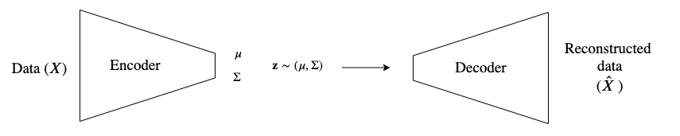
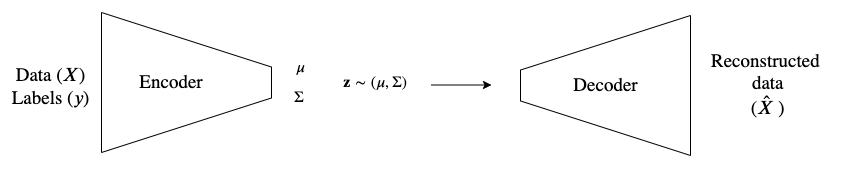
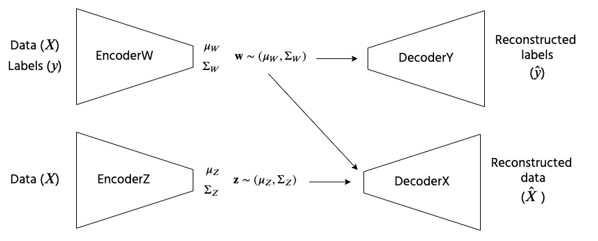
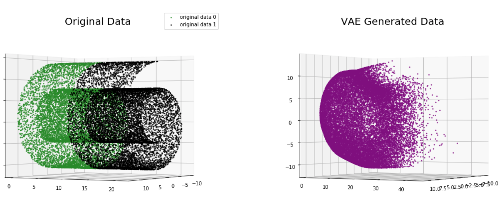
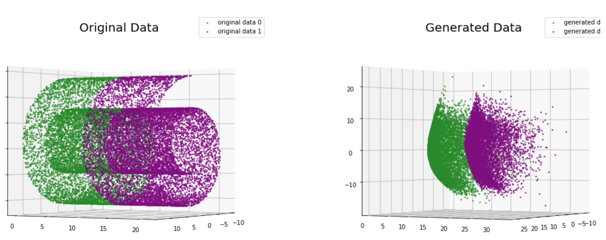
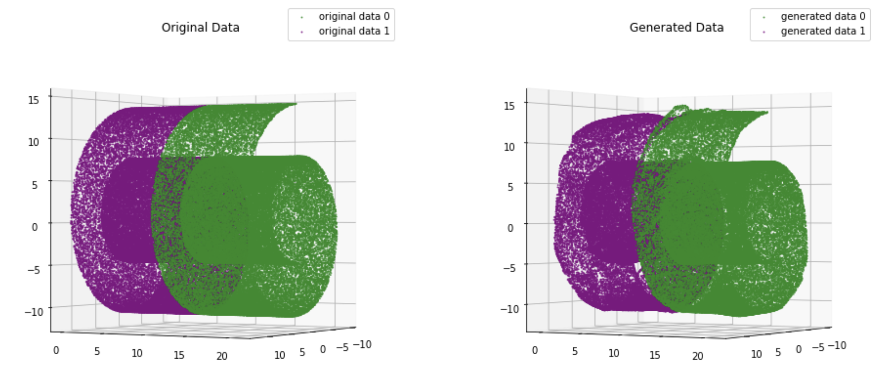

# AM207 Final Project
**Karina Huang, Lipika Ramaswamy, Erin Williams**

---

## Introduction

This repository hosts our implementation of the work by [Klys et al.](http://papers.nips.cc/paper/7880-learning-latent-subspaces-in-variational-autoencoders), _Learning Latent Subspaces in Variational Autoencoders (VAE)_. In particular, we compared the performance of regular VAE, conditional VAE (CVAE), and conditional subspace VAE (CSVAE) using the classic swiss roll dataset.

<u>**Regular VAE**

<kbd>

**Conditional VAE**
<kbd>

**Conditional Subspace VAE**</u>
<kbd>

A summary of our project may be found below; our report lives in `final_report.ipynb`. For detailed implementations of each variation of VAE, please refer to notebooks `vae_swiss_roll.ipynb`,`cvae_swiss_roll.ipynb`,`csvae_swiss_roll.ipynb` in `notebooks/`.

## Experimental Setup

#### Data

100,000 swiss roll data points were made for the CSVAE experiment using `make_swiss_roll` from `sklearn.datasets`. Note that we reduced the number of data points to 20,000 for VAE and CVAE for clearer visualization of the outputs. We used the random state of 207 for training data, and 101 for test data.

The generated data was 3-dimensional, and was split into 2 classes according to the second dimension (y). Data points were labeled class 0 if y < 10, and 1 otherwise.

#### Training

The VAE and CVAE were trained for 100 epochs, and the CSVAE for 20 epochs. Comparisons between the 3 approaches were made using the generated data after the 20th epoch of training. We trained all models using the Adam optimizer, with an initial learning rate of 0.001.

## Results

**VAE - Epoch 20**

_*Note that the generated data is not colored by label as the model does not take labels into account._

**CVAE - Epoch 20**

**CSVAE - Epoch 20**

Comparing the 3 models, we observed that CSVAE clearly had outperformed the other 2 models. Interestingly, while CVAE modeled the shape of the data better than the regular VAE, its reconstructed data extended outside the range of the actual data, an observation that did not occur in the regular VAE training progress. CSVAE was able to reconstruct the swiss-roll shape and distinguish between all 3 dimensions, which both other models failed to do at epoch 30th. However, we observed that the performance of CSVAE is dependent upon proper initialization for the weights of the loss function.
